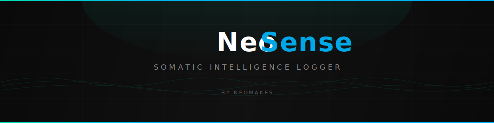
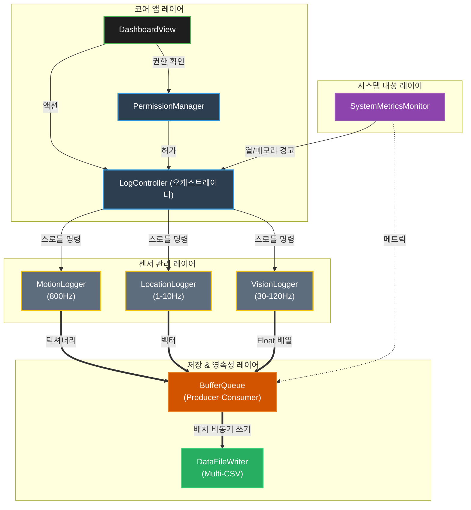

<p align="center">
  
</p>

<p align="center">
  <a href="https://swift.org"></a>
  <a href="https://developer.apple.com/ios/"></a>
  <a href="LICENSE"></a>
  <a href=""></a>
</p>

<p align="center">
  <strong>iPhone 16 Pro용 멀티모달 센서 로깅 테스트베드</strong><br>
  엣지 AI 에이전트 연구를 위한 고주파수 원시 센서 데이터 수집
</p>

<p align="center">
  <a href="README.md">English</a> | <strong>한국어</strong>
</p>

---

## 목차

- [배경 및 동기](#배경-및-동기)
- [주요 기능](#주요-기능)
- [아키텍처](#아키텍처)
- [데이터 스키마](#데이터-스키마)
- [설치](#설치)
- [사용법](#사용법)
- [NeoMakes 생태계](#neomakes-생태계)
- [현재 상태](#현재-상태)
- [로드맵](#로드맵)
- [기여하기](#기여하기)
- [라이선스](#라이선스)

---

## 배경 및 동기

현대 엣지 AI 에이전트는 물리적 컨텍스트를 이해하기 위해 풍부한 실세계 센서 데이터가 필요하지만, 대부분의 데이터셋은 정제되거나 다운샘플링되거나 합성된 것입니다. **NeoSense**는 iPhone 16 Pro의 하드웨어 수준 센서 동작에서 발생하는 날것 그대로의 노이즈까지 포착합니다.

이 프로젝트는 **Physical DataStream 테스트베드**로서, 외수용성(시각, 청각, GPS), 고유수용성(IMU, 액추에이터), 내수용성(열, 배터리, CPU) 신호를 동시에 로깅하여 주파수 지터, 열 스로틀링, OS 스케줄링 지연, 센서 간 크로스토크 등 실세계 간섭 패턴을 반영하는 멀티모달 데이터셋을 생성합니다.

### NeoMakes 파이프라인

NeoSense는 NeoMakes 지능 스택의 **감각 기반**입니다:

```
NeoSense (센서 수집) → PIP / NeoMind (웰니스 지능) → neocog (에이전트 커널)
```

- **NeoSense**: 원시 체성감각 데이터 수집 — 디바이스가 경험하는 물리 세계
- **[PIP](https://github.com/neomakes/PIP_Project)**: 센서 패턴을 개인 웰니스 지능으로 변환
- **[NeoMind / humanWorldModel](https://github.com/neomakes/humanWorldModel)**: 센서 파생 특성으로부터 인간 행동 궤적 모델링
- **[neocog](https://github.com/neomakes/neocog)**: 온디바이스 에이전트 추론의 입력으로 데이터 스트림 소비

결과 데이터 스트림은 온디바이스 AI 에이전트를 위한 하드웨어 수준 MCP 유사 센서 인터페이스로 기능합니다.

---

## 주요 기능

- **오프라인 우선 & 우아한 성능 저하** — 순수 하드웨어 한계를 측정하기 위해 완전히 오프라인으로 동작. CPU 부하와 열 스로틀링에 의한 주파수 변동을 명시적으로 기록합니다.
- **멀티 CSV 아키텍처** — 고주파 모션 데이터(800Hz)와 저주파 GPS 데이터(1Hz)를 독립 비동기 CSV 스트림으로 분리하여 I/O 락 경합을 제거합니다.
- **8개 센서 모듈**:
  - **모션**: 800Hz 가속도계 & 200Hz HDR 자이로스코프
  - **비전 & AR**: ARKit 페이스 트래킹(52 BlendShapes), LiDAR 메시, 카메라 메타데이터
  - **오디오**: 스튜디오급 마이크 레벨(dBFS) 및 오디오 믹스 메타데이터
  - **환경**: 기압계, 주변광 센서(ALS), 색 스펙트럼
  - **위치**: 이중 주파수 GPS(L1+L5), 자력계
  - **시스템 상태**: thermalState, 배터리, CPU/메모리 부하
- **능동 개입** — 토치 강도 제어 및 렌즈 잠금(노출/초점/줌)으로 제어된 스트레스 테스트와 능동 시각 연구를 지원합니다.

---

## 아키텍처

초당 수천 건의 이벤트를 수집하면서도 UI 스레드 안정성을 유지하기 위해 네 개의 레이어로 분리되어 있습니다:

1. **코어 앱 레이어** — SwiftUI 대시보드, Permission Manager, LogController 오케스트레이터
2. **센서 관리 레이어** — 독립 프로바이더 클래스 (MotionLogger, LocationEnvironmentLogger, VisionAudioLogger)
3. **시스템 내성 레이어** — 디바이스 상태 모니터링 (SystemMetricsMonitor) 피드백 루프
4. **저장 & 영속성 레이어** — 논블로킹 BufferQueue → DataFileWriter (Multi-CSV)



---

## 데이터 스키마

모든 CSV 행은 지연, 지터, 드롭아웃 분석을 위한 엄격한 시계열 메타 스키마를 따릅니다:

| 컬럼 | 설명 |
|:--|:--|
| `hw_timestamp` | 하드웨어 수준 생성 시각. 실제 주파수와 지터 계산에 사용. |
| `sys_timestamp` | OS/앱 수준 도착 시각. `hw_timestamp`와의 차이 = OS 스케줄링 지연. |
| `target_hz` | 요청된 목표 주파수. |
| `sys_hz` | 소프트웨어 관측 도착 주파수. `target_hz`와의 차이 = 앱 스케줄링 기아 상태. |
| `thermal_state` | 실시간 디바이스 온도 (0: 정상 → 3: 위험). |

### 센서 커버리지 & 주파수

| 카테고리 | 세부 | 데이터 포인트 | 목표 Hz | 로그 파일 접두사 |
|:--|:--|:--|:--|:--|
| 외수용성 | 비전 | 페이스 BlendShapes(52), LiDAR 메시, 카메라 메타 | 60 / 15 / 30 Hz | `extero_vision_*` |
| | 오디오 | 마이크 피크 & 평균 파워(dBFS) | 10 Hz | `extero_audio_mic` |
| | 공간 | 위도/경도, GPS 방위, 디지털 컴퍼스 | 1 / 30 Hz | `extero_gps_*` |
| | 환경 | 기압, 조도 프록시 | 10 / 1 Hz | `extero_env_*` |
| 고유수용성 | IMU | 가속도계(x,y,z), 자이로스코프(pitch,roll,yaw) | 800 / 200 Hz | `proprio_imu_*` |
| | 액추에이터 | LED 토치, 줌, 노출 잠금 | 이벤트 기반 | `proprio_actuator_*` |
| 내수용성 | 상태 | CPU, GPU, ANE, 열, 메모리, 배터리 | 1 Hz | `intero_sys_health` |

---

## 설치

> **요구 사항**: 이 앱은 실제 iPhone에서 실행해야 합니다 (iPhone 16 Pro 권장). 시뮬레이터는 정확한 센서 데이터를 제공하지 않습니다.

### 사전 준비

- macOS + Xcode 15.0 이상
- iPhone 16 Pro (또는 iOS 17.0+ 호환 기기)
- Apple 개발자 계정 (무료 티어로 개인 기기 테스트 가능)

### 설정

1. 저장소 클론:
   ```bash
   git clone https://github.com/neomakes/neosense.git
   cd neosense
   ```

2. Xcode에서 `NeoSense.xcodeproj`를 엽니다.

3. **NeoSense** 타겟을 선택하고 **Signing & Capabilities**로 이동:
   - **Development Team** 선택
   - Xcode가 프로비저닝을 자동으로 처리합니다

4. iPhone을 연결하고 빌드 & 실행 (Cmd+R)

5. 최초 설치 시 개발자 인증서를 신뢰:
   - **설정 > 일반 > VPN 및 기기 관리**
   - "개발자 앱"에서 Apple ID를 탭
   - **신뢰**를 탭하고 확인

---

## 사용법

### 로깅 세션 실행

1. 앱을 실행하면 대시보드에 모든 센서 토글이 표시됩니다
2. **Phase 1 (격리)**: 개별 센서를 토글하여 기준 주파수를 검증
3. **Phase 2 (스트레스 테스트)**: **LOGGING ALL DATA**를 탭하여 모든 센서를 동시에 활성화 — 의도적으로 열 스로틀링과 주파수 지터를 유발
4. **Phase 3 (능동 감지)**: 로깅 중 액추에이터 패널에서 플래시 펄스를 발생시켜 모터 개입이 센서 노이즈에 미치는 영향을 측정

### 로깅 데이터 접근

1. iPhone에서 **파일** 앱을 열기
2. **나의 iPhone > NeoSense**로 이동
3. 센서별 개별 `.csv` 파일 확인 (예: `proprio_imu_accel_*.csv`)
4. AirDrop, iCloud Drive 또는 USB로 분석을 위해 공유

### 분석

CSV 파일을 Python/Jupyter로 내보내어 시각화:
```python
import pandas as pd

# 고주파 IMU 데이터 로드
accel = pd.read_csv("proprio_imu_accel_session.csv")

# 실제 주파수 vs 목표 주파수 계산
accel['actual_hz'] = 1.0 / accel['hw_timestamp'].diff()
accel['jitter'] = accel['actual_hz'] - accel['target_hz']
```

---

## 디렉토리 구조

```
neosense/
├── README.md
├── README.ko.md
├── LICENSE
├── CONTRIBUTING.md
├── CODE_OF_CONDUCT.md
├── assets/               # 배너 및 미디어 에셋
├── docs/                 # PRD, UX/UI 디자인, 아키텍처 다이어그램
├── analysis/             # Python 분석 스크립트
├── NeoSense/
│   ├── App/              # 앱 진입점 및 생명주기
│   ├── Managers/         # 센서 모듈 (Motion, Location, Vision)
│   ├── Models/           # 데이터 스키마 및 정의
│   ├── Utils/            # 파일 I/O, 포맷팅, 내보내기 유틸리티
│   └── Views/            # SwiftUI 대시보드 및 UI 컴포넌트
└── NeoSense.xcodeproj
```

---

## NeoMakes 생태계

NeoSense는 **NeoMakes** 오픈소스 연구 포트폴리오의 일부입니다 — 극한 환경에서의 인간-AI 상호작용을 위한 원천 기술을 구축합니다.

| 프로젝트 | 역할 | 링크 |
|:--|:--|:--|
| **NeoSense** | 체성감각 센서 수집 | *현재 위치* |
| **PIP** | 개인 지능 플랫폼 | [neomakes/PIP_Project](https://github.com/neomakes/PIP_Project) |
| **humanWorldModel** | VRAE 행동 궤적 모델링 | [neomakes/humanWorldModel](https://github.com/neomakes/humanWorldModel) |
| **neocog** | 온디바이스 에이전트 추론 커널 | [neomakes/neocog](https://github.com/neomakes/neocog) |
| **NeoLAT** | 에이전트 페르소나 평가 테스트베드 | [neomakes/neolat](https://github.com/neomakes/neolat) |
| **EigenLLM** | LLM 분해 연구 | [neomakes/eigenllm](https://github.com/neomakes/eigenllm) |

---

## 현재 상태

**활성** — 8개 전체 모듈에서 센서 로깅이 완성되어 작동 중입니다.

- 모든 센서 모듈이 멀티 CSV 출력으로 동작
- 스트레스 테스트 검증 완료: 열 스로틀링 및 주파수 지터가 예상대로 포착
- Python/Jupyter 분석 파이프라인 동작 확인

**계획 중**: neocog로의 실시간 센서 스트리밍을 위한 gRPC 브릿지.

---

## 로드맵

- [ ] neocog 실시간 스트리밍을 위한 gRPC 통합
- [ ] 실시간 데이터 시각화 대시보드 (온디바이스)
- [ ] 추가 센서 지원 (UWB, NFC 근접)
- [ ] 설정 가능한 로깅 프로파일 (절전 vs. 풀캡처)
- [ ] 이상 탐지가 포함된 자동 분석 파이프라인

---

## 기여하기

기여 가이드라인은 [CONTRIBUTING.md](CONTRIBUTING.md)를 참조하세요.

이 프로젝트는 [행동 강령](CODE_OF_CONDUCT.md)을 따릅니다.

---

## 라이선스

이 프로젝트는 MIT 라이선스를 따릅니다 — 자세한 내용은 [LICENSE](LICENSE)를 참조하세요.

---

*참고: 모든 센서를 동시에 로깅하면 배터리가 빠르게 소모되고 기기 온도가 올라갑니다. 이것은 스트레스 테스트를 위해 의도된 동작입니다.*
