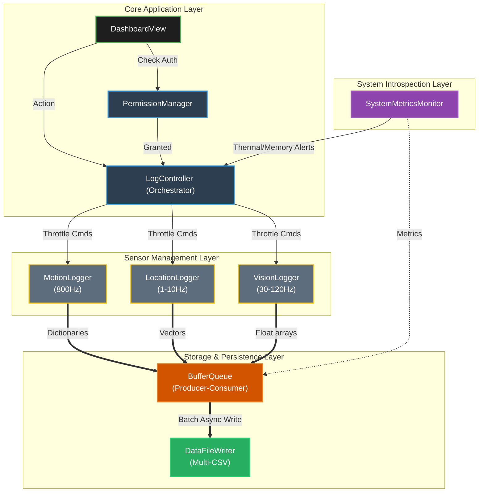

<p align="center">
  
</p>

<p align="center">
  <a href="https://swift.org"></a>
  <a href="https://developer.apple.com/ios/"></a>
  <a href="LICENSE"></a>
  <a href=""></a>
</p>

<p align="center">
  <strong>Multi-modal sensor logging testbed for iPhone 16 Pro</strong><br>
  Capturing raw, high-frequency sensory data for edge AI agent research.
</p>

---

## Table of Contents

- [Background & Motivation](#background--motivation)
- [Key Features](#key-features)
- [Architecture](#architecture)
- [Data Schema](#data-schema)
- [Installation](#installation)
- [Usage](#usage)
- [NeoMakes Ecosystem](#neomakes-ecosystem)
- [Current Status](#current-status)
- [Roadmap](#roadmap)
- [Contributing](#contributing)
- [License](#license)

---

## Background & Motivation

Modern edge AI agents need rich, real-world sensory data to understand physical context — but most datasets are sanitized, downsampled, or synthetic. **NeoSense** captures the raw, noisy reality of hardware-level sensor behavior on the iPhone 16 Pro.

This project serves as a **Physical DataStream testbed**: by logging exteroceptive (vision, audio, GPS), proprioceptive (IMU, actuators), and interoceptive (thermal, battery, CPU) signals simultaneously, it produces multi-modal datasets that reflect real-world interference patterns — frequency jitter, thermal throttling, OS scheduling delays, and sensor crosstalk.

### The NeoMakes Pipeline

NeoSense is the **sensory foundation** of the NeoMakes intelligence stack:

```
NeoSense (sensor capture) → PIP / NeoMind (wellness intelligence) → neocog (agent kernel)
```

- **NeoSense** captures raw somatic data — the physical world as experienced by the device
- **[PIP](https://github.com/neomakes/PIP_Project)** transforms sensor patterns into personal wellness intelligence
- **[NeoMind / humanWorldModel](https://github.com/neomakes/humanWorldModel)** models human behavior trajectories from sensor-derived features
- **[neocog](https://github.com/neomakes/neocog)** consumes these streams as input for on-device agentic inference

The resulting data streams function as a hardware-level MCP-like sensor interface for on-device AI agents.

---

## Key Features

- **Offline-First & Graceful Degradation** — Operates completely offline to capture pure hardware limits. Explicitly records frequency fluctuations caused by CPU load and thermal throttling.
- **Multi-CSV Architecture** — Eliminates I/O lock contention by isolating high-frequency motion data (800Hz) and low-frequency GPS data (1Hz) into independent asynchronous CSV streams.
- **8 Sensor Modules**:
  - **Motion**: 800Hz Accelerometer & 200Hz HDR Gyroscope
  - **Vision & AR**: ARKit Face Tracking (52 BlendShapes), LiDAR Mesh, Raw Camera metadata
  - **Audio**: Studio-quality microphone levels (dBFS) and audio mix metadata
  - **Environment**: Barometer, Ambient Light Sensor (ALS), Color Spectrum
  - **Location**: Dual-frequency GPS (L1+L5), Magnetometer
  - **System Health**: thermalState, Battery, CPU/Memory load
- **Active Intervention** — Torch intensity control and lens lock (exposure/focus/zoom) for controlled stress testing and active vision research.

---

## Architecture

The app is decoupled into four layers to maintain UI thread stability while ingesting thousands of events per second:

1. **Core Application Layer** — SwiftUI Dashboard, Permission Manager, LogController Orchestrator
2. **Sensor Management Layer** — Independent provider classes (MotionLogger, LocationEnvironmentLogger, VisionAudioLogger)
3. **System Introspection Layer** — Device health monitoring (SystemMetricsMonitor) for feedback loops
4. **Storage & Persistence Layer** — Non-blocking BufferQueue → DataFileWriter (Multi-CSV)



---

## Data Schema

Every CSV row enforces a strict time-series meta-schema for analyzing delays, jitters, and dropouts:

| Column | Description |
|:--|:--|
| `hw_timestamp` | Hardware-level creation time. Used to calculate real frequency and jitter. |
| `sys_timestamp` | OS/App-level arrival time. Difference from `hw_timestamp` = OS scheduling delay. |
| `target_hz` | Requested target frequency. |
| `sys_hz` | Software-observed arrival frequency. Difference from `target_hz` = app scheduling starvation. |
| `thermal_state` | Real-time device temperature (0: Nominal → 3: Critical). |

### Sensor Coverage & Frequencies

| Category | Sub-Category | Data Points | Target Hz | Log File Prefix |
|:--|:--|:--|:--|:--|
| Exteroception | Vision | Face BlendShapes (52), LiDAR Mesh, Camera Meta | 60 / 15 / 30 Hz | `extero_vision_*` |
| | Audio | Mic Peak & Average Power (dBFS) | 10 Hz | `extero_audio_mic` |
| | Spatial | Lat/Lon, GPS Heading, Digital Compass | 1 / 30 Hz | `extero_gps_*` |
| | Environment | Barometric Pressure, Lux Proxy | 10 / 1 Hz | `extero_env_*` |
| Proprioception | IMU | Accelerometer (x,y,z), Gyroscope (pitch,roll,yaw) | 800 / 200 Hz | `proprio_imu_*` |
| | Actuator | LED Torch, Zoom, Exposure Lock | Event-based | `proprio_actuator_*` |
| Interoception | Health | CPU, GPU, ANE, Thermal, Memory, Battery | 1 Hz | `intero_sys_health` |

---

## Installation

> **Requirement**: This app must run on a physical iPhone (iPhone 16 Pro recommended). The Simulator does not provide accurate sensor data.

### Prerequisites

- macOS with Xcode 15.0+
- iPhone 16 Pro (or compatible device running iOS 17.0+)
- Apple Developer account (free tier works for personal device testing)

### Setup

1. Clone the repository:
   ```bash
   git clone https://github.com/neomakes/neosense.git
   cd neosense
   ```

2. Open `NeoSense.xcodeproj` in Xcode.

3. Select the **NeoSense** target and go to **Signing & Capabilities**:
   - Select your **Development Team**
   - Xcode will handle provisioning automatically

4. Build and run (Cmd+R) on your connected iPhone.

5. On first install, trust the developer certificate on your iPhone:
   - **Settings > General > VPN & Device Management**
   - Tap your Apple ID under "Developer App"
   - Tap **Trust** and confirm

---

## Usage

### Running a Logging Session

1. Launch the app — the dashboard displays all sensor toggles
2. **Phase 1 (Isolation)**: Toggle individual sensors to validate baseline frequencies
3. **Phase 2 (Stress Test)**: Tap **LOGGING ALL DATA** to activate all sensors simultaneously — this deliberately induces thermal throttling and frequency jitter
4. **Phase 3 (Active Sensing)**: Use the Actuators panel to trigger flash pulses while logging, measuring how motor interventions affect sensor noise

### Accessing Logged Data

1. Open **Files** app on iPhone
2. Navigate to **On My iPhone > NeoSense**
3. Find separate `.csv` files per sensor (e.g., `proprio_imu_accel_*.csv`)
4. Share via AirDrop, iCloud Drive, or USB for analysis

### Analysis

Export CSV files to Python/Jupyter for visualization:
```python
import pandas as pd

# Load high-frequency IMU data
accel = pd.read_csv("proprio_imu_accel_session.csv")

# Calculate actual frequency vs target
accel['actual_hz'] = 1.0 / accel['hw_timestamp'].diff()
accel['jitter'] = accel['actual_hz'] - accel['target_hz']
```

---

## Directory Structure

```
neosense/
├── README.md
├── README.ko.md
├── LICENSE
├── CONTRIBUTING.md
├── CODE_OF_CONDUCT.md
├── assets/               # Banner and media assets
├── docs/                 # PRD, UX/UI design, architecture diagrams
├── analysis/             # Python analysis scripts
├── NeoSense/
│   ├── App/              # App entry point and lifecycle
│   ├── Managers/         # Sensor modules (Motion, Location, Vision)
│   ├── Models/           # Data schemas and definitions
│   ├── Utils/            # File I/O, formatting, export utilities
│   └── Views/            # SwiftUI dashboard and UI components
└── NeoSense.xcodeproj
```

---

## NeoMakes Ecosystem

NeoSense is part of the **NeoMakes** open-source research portfolio — building foundational technology for human-AI interaction in extreme environments.

| Project | Role | Link |
|:--|:--|:--|
| **NeoSense** | Somatic sensor capture | *you are here* |
| **PIP** | Personal Intelligence Platform | [neomakes/PIP_Project](https://github.com/neomakes/PIP_Project) |
| **humanWorldModel** | VRAE behavior trajectory modeling | [neomakes/humanWorldModel](https://github.com/neomakes/humanWorldModel) |
| **neocog** | On-device agentic inference kernel | [neomakes/neocog](https://github.com/neomakes/neocog) |
| **NeoLAT** | Agent persona evaluation testbed | [neomakes/neolat](https://github.com/neomakes/neolat) |
| **EigenLLM** | LLM decomposition research | [neomakes/eigenllm](https://github.com/neomakes/eigenllm) |

---

## Current Status

**Active** — Sensor logging is complete and functional across all 8 modules.

- All sensor modules operational with multi-CSV output
- Stress testing validated: thermal throttling and frequency jitter captured as expected
- Analysis pipeline functional with Python/Jupyter

**Planned**: gRPC bridge to neocog for real-time sensor streaming to on-device agents.

---

## Roadmap

- [ ] gRPC integration for real-time streaming to neocog
- [ ] Real-time data visualization dashboard (on-device)
- [ ] Additional sensor support (UWB, NFC proximity)
- [ ] Configurable logging profiles (power-saving vs. full-capture)
- [ ] Automated analysis pipeline with anomaly detection

---

## Contributing

See [CONTRIBUTING.md](CONTRIBUTING.md) for guidelines on how to contribute.

This project follows the [Code of Conduct](CODE_OF_CONDUCT.md).

---

## License

This project is licensed under the MIT License — see [LICENSE](LICENSE) for details.

---

*Note: Logging all sensors simultaneously will drain battery quickly and increase device temperature. This is intentional for stress testing.*
